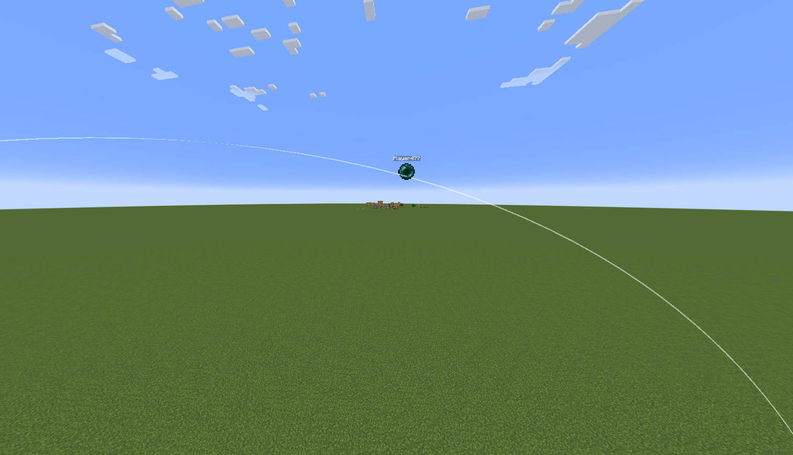
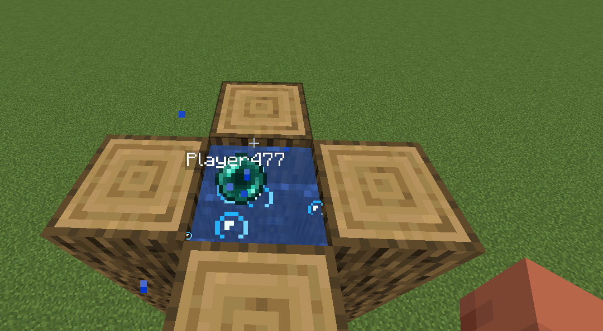

# EnderPearl Tweak Mod (Fabric 1.21.1)

## 🌟 Overview
**EnderPearl Tweak** is a lightweight **Fabric mod** for Minecraft **1.21.1** that enhances the Ender Pearl experience by displaying the **trajectory path** and the **thrower's name** (as a nametag) when an Ender Pearl is launched. This mod is **client-side only**, meaning it works in single-player and multiplayer without requiring server-side installation.

---

## 🔧 Features
### 1. **Trajectory Path Visualization**
- When a player throws an Ender Pearl, a **dotted trajectory line** appears, showing the predicted path.
- Helps with precision aiming, especially in PvP.

### 2. **Thrower Nametag**
- A **floating nametag** appears above the Ender Pearl, displaying the **username** of the player who threw it.
- Useful in multiplayer to identify who is launching pearls (in combat/stasis chamber).

---

## 📦 Requirements
- **Minecraft Version**: 1.21.1
- **Fabric Loader**: ≥0.16.0
- **Fabric API**

---

## 🛠️ Installation
1. Download the latest `.jar` file from [Modrinth/CurseForge link].
2. Place it in your `mods/` folder (located in your Minecraft directory).
3. Launch the game using the **Fabric** profile.

---

## 📜 License
This mod is released under the **MIT License**. Feel free to modify or redistribute it, but credit is appreciated!

---

## 🖼️ Screenshots
*(Insert screenshots here if available)*
- **Trajectory Path**: 
- **Nametag Display**: 

---

**Enhance your Ender Pearl game with EnderPearl Tweak!** 🚀